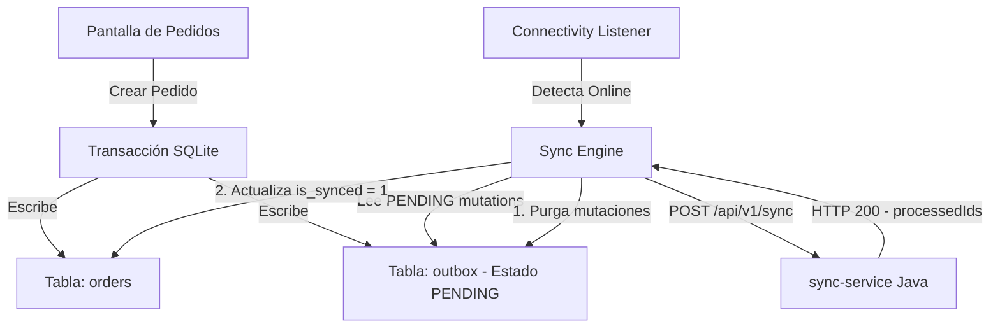

# PRD - Cliente de Registro de Pedidos (UI-HieloPedido)

Este documento define los requerimientos, la arquitectura y las especificaciones técnicas para el cliente frontend (aplicación móvil/web en Flutter) del sistema de registro de pedidos offline-first para la distribución de hielo.

---

## 1. Descripción del Producto
**UI-HieloPedido** es una aplicación cliente diseñada para que los vendedores registren pedidos de bolsas de hielo en la calle. Debido a las fluctuaciones en la señal móvil, la aplicación funciona bajo una arquitectura **Offline-First**: permite al usuario registrar, ver y eliminar pedidos localmente sin internet, y se encarga de sincronizarlos de forma transparente con el backend en cuanto se recupera la conexión.

---

## 2. Arquitectura de Sincronización (Transactional Outbox)

Para garantizar que ningún pedido se pierda y evitar duplicados, la aplicación implementa el patrón **Transactional Outbox** a nivel local:



### 2.1. Base de Datos Local (SQLite)
La persistencia local se realiza mediante el plugin `sqflite`. Consta de dos tablas principales:

#### Tabla `orders`
Guarda el estado actual de los pedidos mostrados en la interfaz.
* `client_order_id` (TEXT PRIMARY KEY) - UUID generado en el cliente.
* `client_name` (TEXT) - Nombre o identificador del cliente.
* `product_id` (TEXT) - ID del producto en el catálogo.
* `product_name` (TEXT) - Nombre legible del producto.
* `quantity` (INTEGER) - Cantidad de bolsas de hielo.
* `price` (REAL) - Precio unitario pactado.
* `created_at` (TEXT) - Fecha y hora de creación (ISO8601).
* `is_synced` (INTEGER) - Bandera binaria (`0` = Pendiente, `1` = Sincronizado).

#### Tabla `outbox`
Guarda el historial de operaciones ("mutaciones") en cola pendientes de ser enviadas al servidor central.
* `id` (TEXT PRIMARY KEY) - UUID de la mutación.
* `entity_type` (TEXT) - Tipo de entidad (siempre `"ORDER"`).
* `entity_id` (TEXT) - El `client_order_id` al que afecta la operación.
* `operation` (TEXT) - Operación a realizar (`"CREATE"`, `"UPDATE"`, `"DELETE"`).
* `payload` (TEXT) - Representación JSON del pedido completo para enviar en peticiones `CREATE` o `UPDATE` (vacío para `DELETE`).
* `timestamp` (INTEGER) - Tiempo del sistema en milisegundos.
* `status` (TEXT) - Estado de la mutación (`"PENDING"`, `"PROCESSING"`, `"FAILED"`).

---

## 3. Integración con el Backend (Spring Boot)

La aplicación móvil se conecta con el microservicio **`sync-service`** expuesto en el puerto **`8081`**.

### 3.1. Endpoint de Sincronización
* **URL:** `POST http://<IP_LOCAL_PC>:8081/api/v1/sync`
* **Cuerpo de Petición:** Un listado de mutaciones pendientes del outbox:
  ```json
  [
    {
      "id": "mutation-uuid-1",
      "entityType": "ORDER",
      "entityId": "order-uuid-abc",
      "operation": "CREATE",
      "payload": "{\"clientOrderId\":\"order-uuid-abc\",\"clientId\":\"Nombre Cliente\",\"salespersonId\":\"VENDEDOR-001\",\"createdAt\":\"2026-07-02T12:00:00\",\"totalAmount\":250.0,\"items\":[{\"productId\":\"PROD-ICE-002\",\"quantity\":1,\"price\":250.0}]}",
      "timestamp": 1785590000000
    }
  ]
  ```

---

## 4. Requerimientos de Carga e Interfaz Gráfica
La interfaz sigue una estética premium (colores tipo Tailwind, fuentes modernas, tarjetas interactivas y animaciones fluidas):
* **Dashboard Principal:** Muestra métricas rápidas (recaudación total, pedidos pendientes) y un indicador de estado de conexión reactivo.
* **Formulario de Pedidos:** Incluye el catálogo oficial de productos seeded en el backend:
  1. `PROD-ICE-001` - Bolsa Hielo Cubos 2kg (\$120.00)
  2. `PROD-ICE-002` - Bolsa Hielo Cubos 5kg (\$250.00)
  3. `PROD-ICE-003` - Bolsa Hielo Molido 10kg (\$450.00)
  4. `PROD-ICE-004` - Bolsa Hielo Escamas 15kg (\$600.00)
* El precio unitario se auto-completa al seleccionar un producto del catálogo, permitiendo modificaciones manuales si es necesario.
